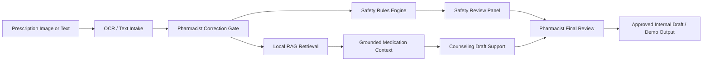
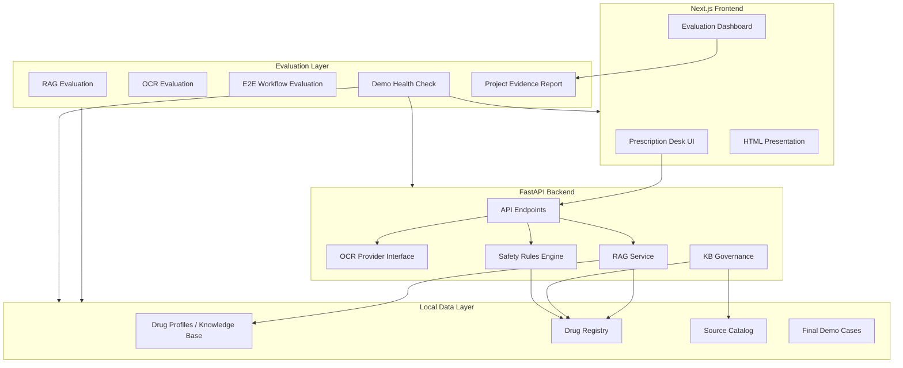
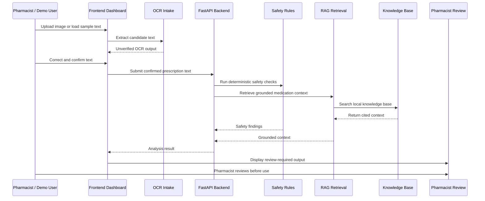
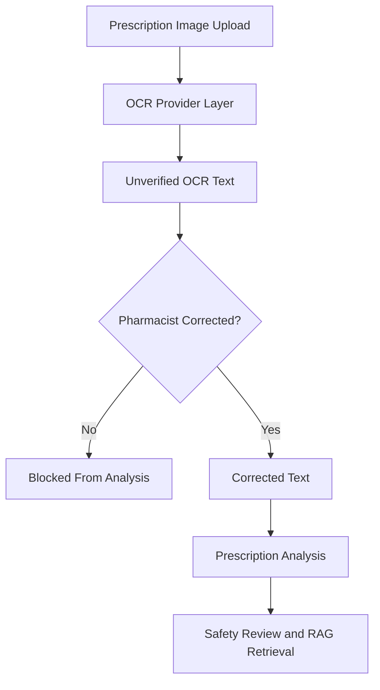
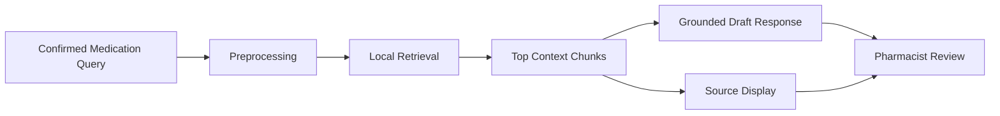
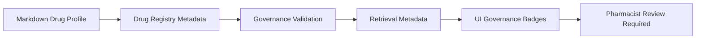
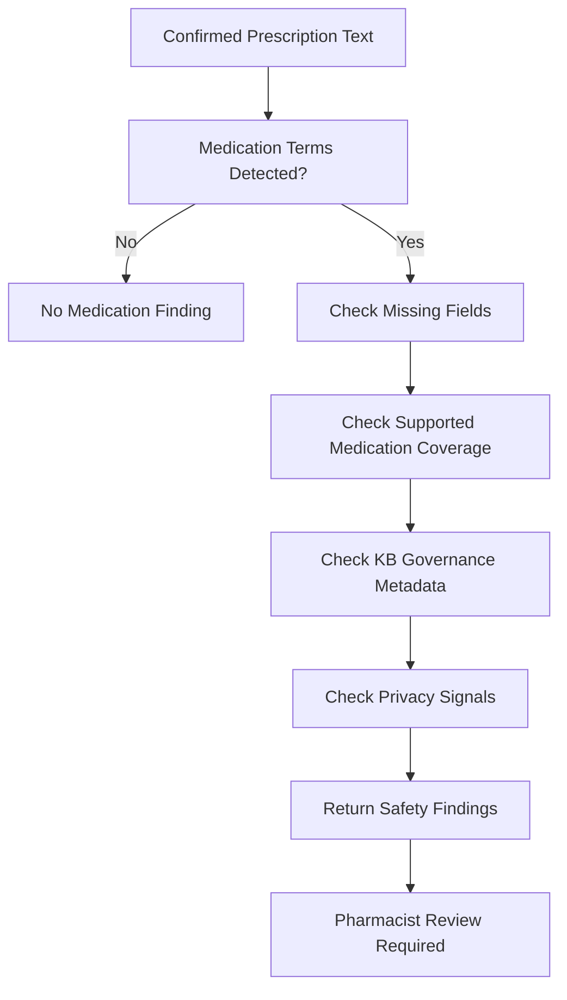
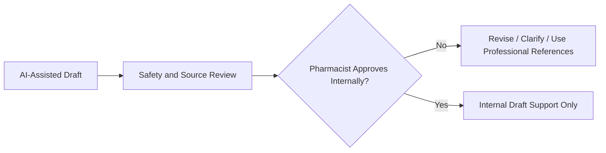
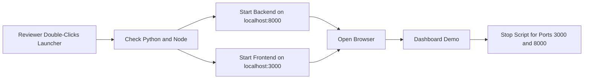
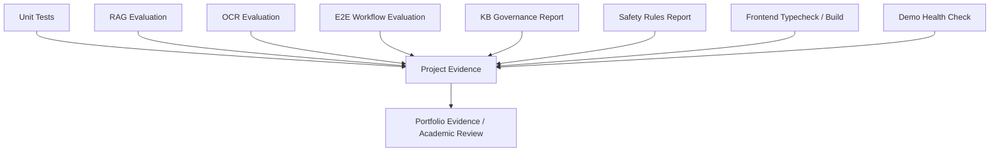

# PharmaGuard AI

## Smart Prescription Desk for Pharmacists

**Full Project Documentation**

**Prototype / Portfolio / Academic Submission**

**Safety-first pharmacist AI copilot**

---

## Document Control

| Field | Value |
|---|---|
| Project name | PharmaGuard AI |
| Product positioning | Smart Prescription Desk for Pharmacists |
| Project type | Pharmacist-centered AI copilot prototype |
| Current status | Demo-ready local prototype |
| Clinical status | Not clinically validated |
| Medical-device status | Not a medical device |
| Patient-facing status | Patient-facing final advice disabled |
| Data policy | Synthetic data only; no real patient data |
| Human oversight | Pharmacist review required |
| Knowledge-base status | Draft placeholder educational content |
| Optional OCR | Tesseract optional, disabled by default, not required for demo startup |

---

# 1. Title Page

PharmaGuard AI is a safety-first AI prototype for pharmacy workflow support. It is
designed as a **Smart Prescription Desk for Pharmacists**, combining prescription
intake, OCR-assisted text extraction, pharmacist correction, local retrieval
from a governed knowledge base, deterministic safety-rule prompts, source
grounding, and evaluation evidence.

This documentation is intended for academic review, portfolio presentation,
pharmacist discussion, and technical architecture evaluation. It describes the
system from idea to implementation while preserving the project's core
limitations: it is a prototype only, it is not clinically validated, it is not a
medical device, and it does not provide final patient-facing advice.

---

# 2. Executive Summary

PharmaGuard AI addresses a practical pharmacy workflow challenge: pharmacists
often need to interpret prescription text, identify missing information, review
medication context, and prepare counseling notes while maintaining strict
professional responsibility. In real pharmacy environments, these tasks may be
affected by unclear handwriting, incomplete directions, missing patient context,
and time pressure. The project explores how an AI-assisted system can support
this work without replacing pharmacist judgment.

The system is built as a pharmacist-centered copilot rather than a generic
chatbot. It does not attempt to make final clinical decisions, diagnose, approve
dispensing, or provide direct patient advice. Instead, it organizes information,
surfaces safety prompts, retrieves local knowledge-base context, and keeps
pharmacist review visible at every stage.

The core workflow follows a controlled path: prescription intake, OCR
extraction if an image is used, pharmacist correction of unverified OCR text,
safety review, grounded local RAG retrieval, pharmacist approval, and counseling
draft generation. This design treats OCR and AI output as assistive signals,
not final truth.

The backend is implemented with Python and FastAPI. The frontend is implemented
with Next.js, TypeScript, and Tailwind CSS. The local RAG layer uses Markdown
drug profiles, a drug registry, source catalog metadata, local TF-IDF retrieval,
retrieval diagnostics, and source-grounded response generation. The OCR layer
uses provider abstractions with local mock and synthetic providers. Tesseract is
present only as an optional, disabled-by-default local adapter and benchmark
path.

Safety is implemented through multiple engineering controls. These include
pharmacist correction gates, deterministic medication safety rules, unsupported
medication handling, insufficient-context responses, citation validation,
knowledge-base governance metadata, patient-facing output restrictions, OCR
provider activation policy, and traceability records for synthetic workflows.

The project is evaluation-driven. The repository includes backend tests, RAG
evaluation, OCR evaluation, end-to-end workflow evaluation, KB governance
reports, safety rules reports, project evidence reporting, final demo cases,
demo health checks, frontend typechecking, and frontend production build
verification. The latest verified results documented for this phase include
177 backend tests passed with 1 skipped, frontend typecheck passed, frontend
build passed, 7 final demo cases, and a demo health check result of 20 PASS,
0 WARN, and 0 FAIL.

The current system is deliberately limited. It uses synthetic data only. The
knowledge base contains draft placeholder educational content and is not
clinically validated. No real patient data, real prescription images, external
medical APIs, cloud OCR providers, production authentication, regulatory
approval, or clinical deployment claims are included.

The value of PharmaGuard AI is therefore not that it is a finished healthcare
product. Its value is that it demonstrates a safer architecture pattern for
pharmacist-centered AI: local evaluation, human review gates, grounded retrieval,
governed knowledge, privacy boundaries, and honest limitations.

---

# 3. Introduction

Pharmacists frequently act as the final professional checkpoint before a
medication reaches a patient. Their work includes verifying prescription
details, checking whether information is missing, clarifying unclear text,
reviewing medication context, and counseling patients. These responsibilities
require accuracy, professional judgment, and awareness of patient-specific
context.

Prescription data can be difficult to interpret. Text may be handwritten,
scanned, incomplete, abbreviated, or ambiguous. OCR tools can assist by
extracting text from images, but OCR output can contain errors. A single
misread medication name, strength, frequency, or duration can create serious
workflow risk if treated as final truth.

Generic AI chatbots are also not appropriate as standalone pharmacy tools.
They may answer fluently while lacking source grounding, workflow context,
pharmacist oversight, privacy boundaries, or domain-specific guardrails.
Healthcare AI requires explicit control surfaces: what information was used,
where it came from, what is missing, and who must approve the result.

PharmaGuard AI demonstrates a safer design pattern. It separates OCR from
analysis, requires pharmacist correction, retrieves from a local governed
knowledge base, surfaces safety-rule prompts, and generates only draft support.
The pharmacist remains responsible for interpretation and approval.

---

# 4. Problem Statement

The project focuses on the following problem areas:

| Problem | Why it matters |
|---|---|
| Unclear prescription text | Medication names, strengths, routes, or instructions can be misread. |
| Missing dose/frequency/duration | Incomplete details require pharmacist review and clarification. |
| Unverified OCR output | OCR can introduce transcription errors and should not trigger downstream analysis automatically. |
| Unsupported medication questions | AI systems must not guess when the knowledge base lacks context. |
| Lack of source grounding | Pharmacists need to see what local context was retrieved. |
| Lack of governance | Healthcare knowledge must track review status, source status, and validation state. |
| Evaluation difficulty | AI workflows need repeatable tests and synthetic cases before real-world consideration. |

The central design question is:

> How can an AI system support prescription review while keeping pharmacists in
> control, avoiding unsupported claims, and preserving safety and privacy
> boundaries?

---

# 5. Why This Project Matters Now

AI copilots are becoming common across professional software. OCR tools are
more accessible, retrieval-augmented generation has become a practical way to
ground responses, and software teams are increasingly exploring AI-assisted
healthcare workflows.

At the same time, healthcare AI requires stronger boundaries than general
productivity tools. A useful pharmacy AI prototype must be able to say when it
does not know, show its sources, require human review, preserve privacy, and
avoid final medical advice.

PharmaGuard AI matters because it demonstrates these boundaries as part of the
architecture rather than as a late disclaimer. OCR is not trusted automatically.
RAG is tied to local governed sources. Safety rules are deterministic prompts,
not clinical decisions. Evaluation scripts are part of the repository. The UI
is designed around pharmacist review rather than chat-style autonomy.

---

# 6. Target Users and Stakeholders

| Stakeholder | Interest in the project |
|---|---|
| Pharmacists | Review prescription text, missing information, retrieved sources, and draft counseling notes. |
| Pharmacy students | Learn how AI support systems can be designed with safety gates and source grounding. |
| Healthcare AI reviewers | Evaluate safety framing, workflow controls, and governance boundaries. |
| Academic evaluators | Review the problem, implementation, testing, limitations, and project evolution. |
| Developers | Study a local-first AI architecture with FastAPI, Next.js, RAG, OCR abstraction, and evaluation scripts. |
| Future integrators | Understand what would be needed before connecting to real pharmacy systems. |

---

# 7. Project Objectives

## 7.1 Functional Objectives

- Provide a pharmacist dashboard for prescription review.
- Accept synthetic prescription text input.
- Provide OCR-assisted intake for synthetic image fixtures.
- Require pharmacist correction before OCR text moves downstream.
- Retrieve medication context from local knowledge-base profiles.
- Generate pharmacist-support counseling drafts.
- Display source grounding, safety prompts, and review requirements.
- Provide local one-click demo launch scripts for reviewers.

## 7.2 Technical Objectives

- Use a clean FastAPI backend.
- Use a Next.js, TypeScript, and Tailwind frontend.
- Keep OCR provider logic modular and policy-gated.
- Keep RAG local, deterministic, and testable.
- Represent knowledge-base governance through structured metadata.
- Add evaluation scripts that can run without internet access.
- Preserve API stability and backward compatibility.

## 7.3 Safety Objectives

- Keep pharmacist review mandatory.
- Prevent unverified OCR from triggering analysis automatically.
- Return insufficient context instead of guessing.
- Keep generated text as draft support only.
- Keep patient-facing final advice disabled.
- Avoid real patient data and real prescription images.
- Avoid clinical validation claims.

## 7.4 Evaluation Objectives

- Test backend behavior with pytest.
- Evaluate RAG retrieval with synthetic cases.
- Evaluate OCR behavior with synthetic fixtures.
- Evaluate end-to-end workflow boundaries.
- Validate KB governance metadata.
- Report safety-rule behavior with deterministic scenarios.
- Provide a demo health check for packaging readiness.

## 7.5 Demo and Portfolio Objectives

- Provide a polished pharmacist dashboard.
- Provide a static evidence page.
- Provide a presentation-ready documentation package.
- Provide final demo cases and a final demo report.
- Provide local launch scripts for non-developer reviewers.

---

# 8. Project Scope

| In Scope | Out of Scope |
|---|---|
| Synthetic prescription text | Real patient use |
| OCR intake prototype | Autonomous dispensing decisions |
| Pharmacist correction gate | Clinical validation |
| Local grounded KB retrieval | Real EHR or pharmacy system integration |
| Deterministic safety rules | Patient-facing final advice |
| Evaluation dashboard | Production regulatory approval |
| Local demo launch | Cloud OCR deployment |
| Draft counseling support | Diagnosis or prescribing |
| KB governance metadata | Real clinical interaction engine |

---

# 9. High-Level System Overview



The system begins with either prescription text or a prescription image. If an
image is used, OCR output is treated as unverified. The pharmacist must correct
or confirm the text before it can be submitted for prescription analysis.

Once corrected text is available, deterministic safety rules check for missing
information, unsupported medication terms, multiple medication mentions,
possible identifiers, placeholder knowledge-base limitations, and pharmacist
review requirements. In parallel, the RAG layer retrieves local source context
from draft Markdown drug profiles. The output is displayed as pharmacist-support
draft information, not final advice.

---

# 10. System Architecture



The architecture is intentionally modular. The frontend focuses on workflow
clarity. The backend owns service boundaries and safety checks. The data layer
contains local Markdown profiles, JSON governance registries, and synthetic
evaluation cases. The evaluation layer provides repeatable evidence for the
prototype without relying on external services.

---

# 11. Technology Stack

| Technology | Role in project | Why selected | Safety / engineering benefit |
|---|---|---|---|
| Next.js | Frontend application | Modern React framework with route support | Enables polished dashboard and static evaluation page |
| TypeScript | Frontend type safety | Safer UI development | Reduces interface mistakes |
| Tailwind CSS | Styling | Fast, consistent UI styling | Supports responsive pharmacist dashboard |
| FastAPI | Backend API | Python API framework with clear schemas | Clean service boundaries and testable endpoints |
| Python | Backend services and scripts | Strong ecosystem for AI workflow prototyping | Simple evaluation scripts and pytest support |
| Local RAG | Retrieval and grounding | Keeps answers tied to local context | Reduces unsupported generation risk |
| TF-IDF/local retrieval | Baseline retrieval | Lightweight, deterministic, no model download | Stable, offline evaluation baseline |
| OCR provider abstraction | OCR intake boundary | Allows future provider swap without changing workflow | Keeps OCR policy-gated and unverified |
| Optional Tesseract | Local OCR candidate | Local engine candidate for benchmarks | Disabled by default, no cloud dependency |
| Markdown KB | Drug profile content | Easy to inspect and edit | Human-readable source files |
| JSON registry/source catalog | Governance metadata | Structured validation and reporting | Makes review state explicit |
| Pytest | Backend tests | Deterministic regression coverage | Prevents safety behavior regressions |
| Evaluation scripts | Evidence reporting | Repeatable local checks | Supports academic and portfolio review |
| Windows launch scripts | Demo packaging | Easier local launch for reviewers | Reduces setup friction |

---

# 12. Why These Technologies Were Used

## 12.1 Why Not a Generic Chatbot?

A generic chatbot does not naturally enforce prescription workflow boundaries.
It may answer without clear retrieved sources, correction gates, governance
metadata, or pharmacist approval steps. PharmaGuard AI is designed around
workflow control rather than open-ended conversation.

## 12.2 Why RAG Instead of Pure Generation?

RAG allows the system to retrieve local context before drafting a response. This
does not guarantee clinical correctness, but it creates a traceable path from
query to source context. If the system cannot retrieve relevant context, it can
return insufficient knowledge-base context instead of guessing.

## 12.3 Why an OCR Correction Gate?

OCR can misread medication names or instructions. PharmaGuard AI therefore
treats OCR text as unverified and requires pharmacist correction before
analysis, retrieval, or counseling draft generation.

## 12.4 Why Deterministic Safety Rules?

Deterministic rules are predictable, testable, and auditable. They do not
replace professional judgment, but they can consistently flag missing fields,
unsupported medication terms, possible identifiers, and policy restrictions.

## 12.5 Why a Local-First Prototype?

Local-first design avoids external APIs, cloud OCR, real patient data, and
network dependency during prototype evaluation. This makes the project safer
for academic and portfolio review.

## 12.6 Why Human-in-the-Loop?

Pharmacists are accountable for professional decisions. The system supports
their review process but does not approve medications, diagnose, prescribe, or
provide final patient-facing advice.

## 12.7 Why Separate Frontend and Backend?

The separation keeps the UI workflow independent from backend service logic.
The backend can be tested with pytest and evaluation scripts, while the
frontend can evolve as a professional pharmacist dashboard.

## 12.8 Why Evaluation Scripts?

Evaluation scripts make project behavior explainable and repeatable. They also
separate engineering validation from clinical validation, which the project does
not claim.

---

# 13. End-to-End Workflow



Workflow explanation:

1. The pharmacist or demo user enters prescription text or uploads a synthetic
   image fixture.
2. OCR output, if present, is displayed as unverified text.
3. The pharmacist corrects or confirms OCR text.
4. Corrected text becomes the only acceptable downstream input.
5. The backend runs medication extraction and deterministic safety rules.
6. The RAG layer retrieves relevant local knowledge-base context.
7. The frontend displays safety findings, source grounding, and draft support.
8. The pharmacist reviews the result before any use.

---

# 14. OCR Intake and Correction Gate

OCR is useful for prescription intake, but it is unsafe to treat OCR output as
final truth. PharmaGuard AI therefore separates OCR extraction from prescription
analysis. OCR output must be corrected or confirmed by a pharmacist before it
can move downstream.

Current OCR properties:

- OCR output is unverified.
- Pharmacist correction is mandatory.
- Uploaded images are not stored by default.
- Possible identifiers are flagged as possible identifiers, not confirmed PII.
- Default OCR providers are local mock/synthetic providers.
- Tesseract is optional, disabled by default, and not required for demo startup.
- No cloud OCR provider is active.



The gate is a workflow control. It prevents raw OCR from automatically
triggering prescription analysis, RAG retrieval, lookup, or counseling.

---

# 15. RAG System and Source Grounding

Retrieval-augmented generation is used to connect pharmacist-support output to
local knowledge-base context. In this project, RAG does not mean the system is
clinically validated. It means the system retrieves local draft educational
content and makes the retrieved context visible.



RAG supports:

- source-grounded response drafting;
- insufficient-context behavior for unknown medications;
- retrieved source display;
- citation validation;
- governance metadata visibility;
- pharmacist review before use.

The RAG layer avoids unsupported generation by using retrieved local context as
the basis for draft output. If relevant context is missing or weak, the system
should return insufficient knowledge-base context rather than inventing content.

---

# 16. Knowledge Base Governance

The knowledge base is currently composed of local Markdown drug profiles,
structured registry metadata, and a source catalog. The profiles are draft
placeholder educational content only.

Key governance concepts:

- `drug_registry.json` tracks drug identity, aliases, profile files, source
  status, review status, clinical validation status, and output restrictions.
- `source_catalog.json` defines source categories and requirements for future
  trusted-source workflows.
- Current profiles remain draft, placeholder educational, and not clinically
  validated.
- Patient-facing output is disabled.
- Counseling draft support is allowed only under pharmacist review.



Governance matters because healthcare AI needs clear separation between
placeholder content, reviewed content, trusted-source-ready content, and
clinically validated content. PharmaGuard AI does not currently promote any
profile to clinical validation.

---

# 17. Retrieval Intelligence

The project includes retrieval intelligence around the stable local retriever.
This includes retrieval strategy comparison, diagnostics, and deterministic
query classification. The purpose is to evaluate retrieval quality without
replacing the default path prematurely.

Current retrieval intelligence includes:

- existing default retrieval strategy;
- lexical overlap comparison;
- metadata-boosted comparison;
- optional hybrid-local comparison if available in the current code path;
- query classification into categories such as lookup, counseling, safety
  check, dose/frequency check, multiple medication review, unsupported or
  unknown, and ambiguous;
- retrieval diagnostics for weak, insufficient, single-source, placeholder-only,
  or pharmacist-review-required retrieval.

The current evidence report documents retrieval strategy evaluation as PASS and
keeps the existing default retriever as the recommended default.

---

# 18. Medication Safety Rules

PharmaGuard AI includes deterministic safety-rule findings for workflow support.
These rules are not a clinical decision engine. They are structured prompts for
pharmacist review.

Supported rule categories include:

| Rule area | Purpose |
|---|---|
| Missing dose | Prompt pharmacist to verify dose details. |
| Missing frequency | Prompt pharmacist to verify frequency details. |
| Missing duration | Prompt pharmacist to verify treatment duration if relevant. |
| Missing route | Prompt pharmacist to verify route where needed. |
| Unsupported medication | Avoid guessing when medication is not covered. |
| Multiple medications | Prompt separate review of each medication. |
| No medication detected | Block unsupported downstream assumptions. |
| Possible identifiers | Flag possible privacy-sensitive text. |
| Draft KB content | Remind reviewer content is placeholder educational material. |
| Patient-facing output blocked | Prevent final patient advice. |
| Pharmacist review required | Keep professional review mandatory. |



Interaction and contraindication checking are explicitly unavailable in this
prototype. Future implementation would require trusted-source ingestion,
pharmacist review workflow, validation, and legal/privacy review.

---

# 19. Pharmacist-in-the-Loop Design

The system is intentionally designed so the AI supports the pharmacist rather
than replacing the pharmacist.

Pharmacist-in-the-loop controls include:

- OCR correction before analysis;
- review-required badges;
- source grounding display;
- draft-only counseling language;
- safety findings shown as prompts;
- patient-facing output disabled;
- insufficient-context behavior;
- governance warnings for draft content.



This design is essential because pharmacy decisions require professional
responsibility, patient-specific context, and validated references.

---

# 20. Privacy and Data Safety

PharmaGuard AI uses synthetic data only. The repository must not contain real
prescriptions, patient names, phone numbers, identifiers, addresses, clinic
identifiers, or real patient images.

Privacy controls include:

- no real patient data in repository files;
- synthetic OCR fixtures only;
- no uploaded image storage by default;
- possible identifier warnings;
- local-only default providers;
- no external OCR APIs;
- no external medical APIs;
- no patient-facing final advice.

The project demonstrates privacy-aware design but does not claim production
privacy compliance. A real deployment would require authentication, audit
retention policy, access controls, encryption strategy, legal review, and
institution-specific governance.

---

# 21. User Interface and Demo Experience

The frontend is a pharmacist command-center dashboard rather than a generic
chatbot. It communicates workflow status, safety boundaries, and source
grounding.

Current UI areas include:

- branded header and safety badges;
- prescription text input;
- prescription image intake;
- OCR correction interface;
- workflow status panel;
- safety review panel;
- pharmacist review panel;
- drug information card;
- source grounding panel;
- knowledge-base context display;
- counseling draft display;
- static evidence dashboard at `/evaluation`;
- presentation-ready HTML file in `docs/presentation.html`.

The UI is designed to make safety state visible. It emphasizes that OCR is
unverified, correction is required, RAG context is grounded in local sources,
counseling is draft-only, and pharmacist review remains mandatory.

---

# 22. One-Click Local Demo Packaging

Phase 5 added a local demo launch experience so reviewers can run the project
more easily without manually typing several terminal commands.

Files added:

- `start-pharmaguard-demo.bat`
- `start-pharmaguard-demo.ps1`
- `stop-pharmaguard-demo.bat`
- `stop-pharmaguard-demo.ps1`
- `scripts/start_demo.py`
- `backend/scripts/demo_health_check.py`
- `docs/local_demo_guide.md`
- `docs/troubleshooting.md`

Launch behavior:

- starts the FastAPI backend from `backend/`;
- starts the Next.js frontend from `frontend/`;
- opens `http://localhost:3000`;
- keeps backend and frontend in separate terminal windows where possible;
- prints clear status messages;
- checks Python and npm availability;
- does not require Tesseract;
- preserves the same safety and prototype boundaries.



This improves accessibility for academic evaluators, pharmacists, and
portfolio reviewers who may not want to manually run multiple development
commands.

---

# 23. Evaluation Methodology

Evaluation in this project is engineering validation, not clinical validation.
The goal is to prove that safety boundaries, retrieval behavior, workflow gates,
and demo packaging work as expected on synthetic data.

Evaluation layers include:

- backend unit and regression tests;
- RAG evaluation;
- OCR evaluation;
- end-to-end OCR-to-RAG workflow evaluation;
- KB report and governance report;
- retrieval strategy evaluation;
- safety rules report;
- project evidence report;
- final demo report;
- demo health check;
- frontend typecheck;
- frontend production build.



---

# 24. Verified Results

The following results are verified from the current project reports and recent
commands used for the final packaging phase.

| Check | Result |
|---|---|
| Frontend typecheck | Passed |
| Frontend build | Passed, including `/evaluation` |
| Backend pytest | 177 passed, 1 skipped |
| Final demo report | 7 demo cases |
| Demo health check | 20 PASS, 0 WARN, 0 FAIL |
| Project evidence report | Passed |
| Git diff check | Passed with normal CRLF/LF warnings only |

Additional evidence documented by the current project evidence report:

| Evidence area | Current documented result |
|---|---|
| RAG evaluation | 46/46 passed |
| Retrieval strategy evaluation | PASS; recommended default `existing_default` |
| KB report | PASS; 15 profiles; 0 blockers |
| KB governance | PASS; 0 blockers; 0 patient-facing profiles |
| OCR evaluation | 18/18 passed; 10 fixture-backed cases |
| Safety rules report | 10/10 scenarios passed; patient-facing blocked count 10 |
| E2E workflow evaluation | 10/10 passed |
| Tesseract benchmark | Safe skip if dependency unavailable; optional and policy-gated |

These numbers are project evidence for synthetic engineering checks only. They
do not represent clinical validation.

---

# 25. Demo Scenarios

The final demo cases are synthetic and stored in
`data/evaluation/final_demo_cases.json`. The current final demo report includes
7 cases.

| Case | Scenario | What it demonstrates |
|---|---|---|
| DEMO-001 | Clean single-medication prescription | Baseline text analysis and local RAG retrieval for paracetamol. |
| DEMO-002 | OCR correction boundary | Unverified OCR is corrected before downstream analysis. |
| DEMO-003 | Missing dose or frequency prompt | Safety rules surface missing details instead of inventing them. |
| DEMO-004 | Multiple medications detected | Multiple medication workflow review and explicit interaction-check limitation. |
| DEMO-005 | Unsupported medication | Unknown medication returns insufficient context instead of arbitrary retrieval. |
| DEMO-006 | Possible identifier warning | Privacy warning behavior for synthetic identifier-like text. |
| DEMO-007 | Insufficient KB context | Ambiguous condition-like text does not map to a drug or infer treatment. |

All demo cases are synthetic. They should not be interpreted as clinical
examples or patient-specific guidance.

---

# 26. Discussion

PharmaGuard AI demonstrates that a safer AI workflow is possible when the
system is designed around professional review rather than automation. The
project shows that OCR can be helpful but must be gated, that RAG can improve
traceability but requires governance, and that deterministic safety rules can
make missing information visible without becoming clinical decision logic.

The project also shows the importance of UI design in safety-critical support
tools. A pharmacist should immediately understand whether OCR is verified,
whether sources were retrieved, whether knowledge-base content is draft-only,
and whether review is required. These signals are part of the product design,
not just backend logic.

The evaluation approach is also a key contribution. The repository includes
repeatable scripts and synthetic cases that make behavior inspectable. This is
not the same as clinical validation, but it is an important engineering step
before any future real-world consideration.

---

# 27. Comparison with a Generic Chatbot

| Capability | Generic chatbot | PharmaGuard AI |
|---|---|---|
| Source grounding | Often unclear or implicit | Local retrieved context is displayed |
| OCR correction | Usually not workflow-gated | OCR output is unverified and correction-gated |
| Pharmacist review | May be optional or unclear | Mandatory throughout workflow |
| Safety rules | Often prompt-dependent | Deterministic rule findings |
| KB governance | Usually absent | Registry, source catalog, review status, validation status |
| Evaluation reports | Often external or missing | Repo-local reports and synthetic cases |
| Patient-facing restrictions | May answer directly | Patient-facing final advice disabled |
| Demo reproducibility | Depends on external services | Local scripts and synthetic data |
| Unsupported context | May still answer | Insufficient-context behavior expected |

---

# 28. Current Limitations

Current limitations include:

- not clinically validated;
- not a medical device;
- not ready for real patient use;
- draft placeholder educational knowledge base only;
- no trusted clinical source ingestion;
- no pharmacist-reviewed drug profiles;
- no real patient data;
- no real prescription images;
- no production authentication or authorization;
- no production audit persistence;
- no real pharmacy system integration;
- no real clinical interaction engine;
- no contraindication engine;
- no diagnosis or prescribing support;
- optional OCR provider only;
- Tesseract disabled by default;
- no regulatory approval;
- synthetic evaluation only.

These limitations are intentional and should remain visible in any presentation.

---

# 29. What Is Needed for Real Pharmacist Use

Before any real pharmacist workflow use, the project would require:

- trusted drug database ingestion;
- pharmacist-reviewed knowledge-base profiles;
- clinical validation studies;
- privacy and security review;
- authentication and authorization;
- persistent audit logs with retention policy;
- real OCR validation on approved datasets;
- pharmacy-system integration planning;
- regulatory and legal review;
- accessibility and localization validation;
- shadow-mode pilot under professional supervision;
- incident response and monitoring plans.

The current project is a foundation and demonstration, not a deployable clinical
system.

---

# 30. Future Work / Roadmap

| Future phase | Focus |
|---|---|
| Phase 6: Pharmacist Pilot Readiness | Prepare workflows, documentation, and shadow-mode criteria for supervised evaluation. |
| Phase 7: Trusted Clinical KB Workflow | Introduce trusted-source ingestion, provenance, and pharmacist review sign-off. |
| Phase 8: Auth, Audit, and Privacy | Add user roles, access controls, audit persistence, and privacy controls. |
| Phase 9: Realistic OCR Validation | Evaluate real OCR providers on approved, de-identified, governed datasets. |
| Phase 10: Deployment and Pilot Study | Package for controlled deployment research after validation and governance approval. |

No future phase should bypass pharmacist review or patient-data safeguards.

---

# 31. Conclusion

PharmaGuard AI is a safety-first, evaluation-driven prototype that demonstrates
how AI can support pharmacists without replacing them. It combines OCR intake,
pharmacist correction, local RAG, knowledge-base governance, deterministic
safety rules, workflow traceability, evaluation evidence, and a polished local
demo experience.

The project's most important design choice is restraint. It does not claim
clinical validation, does not provide final medical advice, does not use real
patient data, and does not present itself as a medical device. Instead, it
shows how an AI pharmacist support system can be structured so that safety,
governance, traceability, and human oversight are central from the beginning.

---

# 32. Appendix A: How to Run Locally

## 32.1 One-Click Windows Launch

From the repository root, double-click:

```text
start-pharmaguard-demo.bat
```

Or run:

```powershell
.\start-pharmaguard-demo.ps1
```

The launcher starts:

- backend API at `http://localhost:8000`;
- frontend dashboard at `http://localhost:3000`;
- evaluation page at `http://localhost:3000/evaluation`.

## 32.2 Stop the Demo

From the repository root, double-click:

```text
stop-pharmaguard-demo.bat
```

Or run:

```powershell
.\stop-pharmaguard-demo.ps1
```

## 32.3 Manual Launch

Backend:

```powershell
cd backend
python -m uvicorn app.main:app --reload --host 127.0.0.1 --port 8000
```

Frontend:

```powershell
cd frontend
npm.cmd run dev -- --hostname 127.0.0.1 --port 3000
```

Use `npm.cmd` on Windows if PowerShell blocks `npm.ps1`.

---

# 33. Appendix B: Important Commands

Frontend:

```powershell
cd frontend
npm.cmd run typecheck
npm.cmd run build
```

Backend:

```powershell
cd backend
python -m pytest
python scripts/project_evidence_report.py
python scripts/final_demo_report.py
python scripts/demo_health_check.py
```

Repository:

```powershell
git diff --check
```

Additional evaluation commands available in the repository include:

```powershell
cd backend
python scripts/evaluate_rag.py
python scripts/evaluate_retrieval_strategies.py
python scripts/kb_report.py
python scripts/kb_governance_report.py
python scripts/safety_rules_report.py
python scripts/evaluate_ocr.py
python scripts/evaluate_e2e_workflow.py
python scripts/e2e_trace_report.py
```

---

# 34. Appendix C: File Structure

Important files and directories:

```text
pharmaguard-ai/
  backend/
    app/
      api/                  FastAPI route modules
      services/             Application services
      rag/                  Local RAG, diagnostics, evaluation
      kb/                   KB registry, validation, governance
      ocr/                  OCR providers, policy, benchmark support
      safety/               Deterministic safety rules
      workflows/            E2E evaluation and traceability
    scripts/                Evaluation and report scripts
    tests/                  Pytest test suite
  frontend/
    app/                    Next.js routes
    components/             Dashboard UI components
    lib/                    API client and shared types
    public/brand/           Brand assets
  data/
    drug_profiles/          Draft Markdown profiles, registry, source catalog
    evaluation/             Synthetic evaluation and demo cases
    private/                Local ignored private-data placeholder
  docs/
    PROJECT_STATE.md
    PharmaGuard_AI_Documentation.md
    PharmaGuard_AI_Full_Project_Documentation.md
    presentation.html
    local_demo_guide.md
    troubleshooting.md
  scripts/
    start_demo.py           Cross-platform guided demo checker
  start-pharmaguard-demo.*
  stop-pharmaguard-demo.*
```

---

# 35. Appendix D: Diagram Index

| Section | Diagram |
|---|---|
| 9 | High-level system workflow |
| 10 | System architecture |
| 13 | End-to-end sequence diagram |
| 14 | OCR correction gate |
| 15 | RAG source-grounding pipeline |
| 16 | Knowledge-base governance flow |
| 18 | Medication safety-rule decision graph |
| 19 | Pharmacist approval flow |
| 22 | One-click demo launch flow |
| 23 | Evaluation methodology graph |

---

# 36. PDF Export Note

This file is Markdown and is designed to be PDF-export friendly. No PDF is
generated by default because the repository avoids adding unnecessary
dependencies. A reviewer can export it later using a local Markdown-to-PDF tool
such as a code editor extension, Pandoc, or another approved document workflow.

When exporting, keep Mermaid rendering enabled if diagrams are needed in the
PDF. If Mermaid rendering is unavailable, export the Markdown text and use the
diagram code blocks as architecture references.
